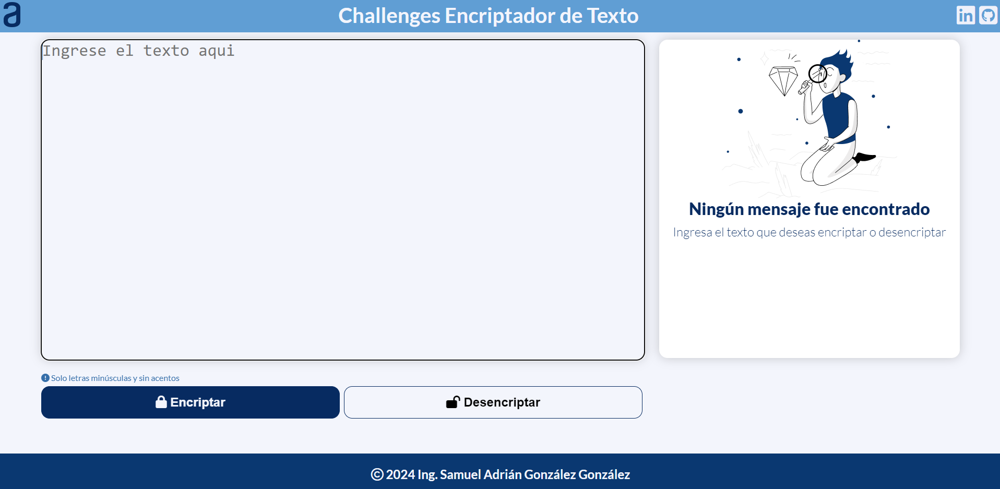

# Challenge ONE Sprint 01: Construye un encriptador de texto con Javascript

## Descripción del proyecto
Se desarrolla una aplicación para encriptar textos, con la finalidad de intercambiar mensajes secretos con otras personas, utilizando esta herramienta se puede encriptar o desencriptar mensajes.

### Las "llaves" de encriptación que se utilizaron son las siguientes
- La letra "e" es convertida para "enter"
- La letra "i" es convertida para "imes"
- La letra "a" es convertida para "ai"
- La letra "o" es convertida para "ober"
- La letra "u" es convertida para "ufat"

### Requisitos:
- Debe funcionar solo con letras minúsculas
- No deben ser utilizados letras con acentos ni caracteres especiales
- Debe ser posible convertir una palabra para la versión encriptada también devolver una palabra encriptada para su versión original.

### Ejemplo:
- "gato" => "gaitober"
- "gaitober" => "gato"

#### Extras
- Se agrego un boton para copiar el texto encriptado/desencriptado en el portapapeles, tiene la misma funcionalidad del CTRL + C o de la opción "copiar" del menú contextual.

## Elaborado por

[Ing. Samuel Adrián González González](mailto:samueladriang@gmail.com).